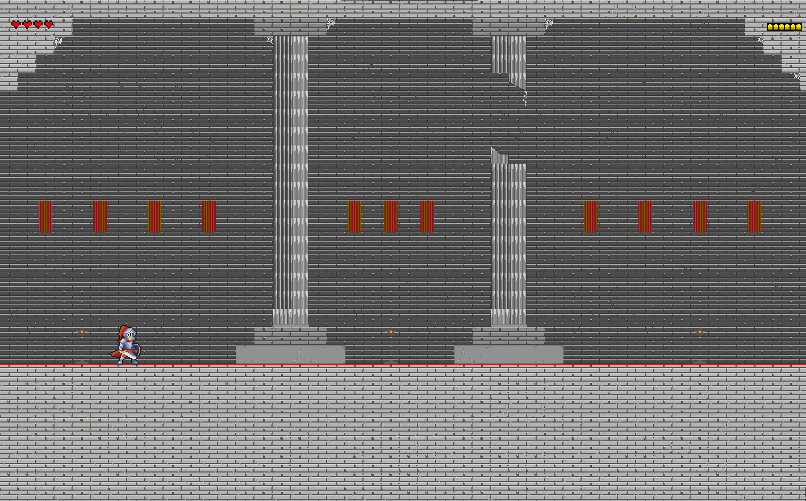
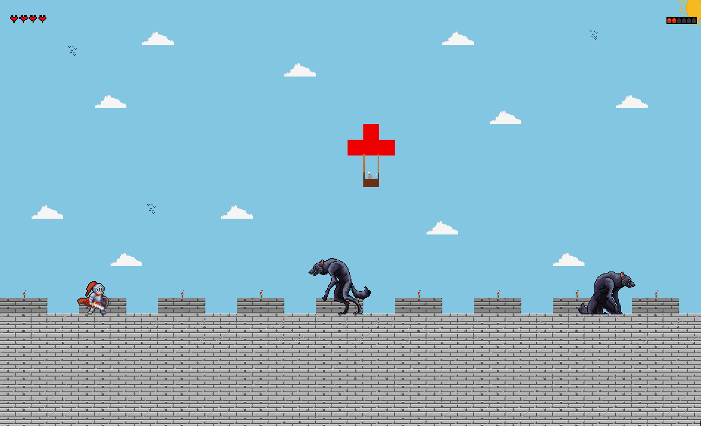
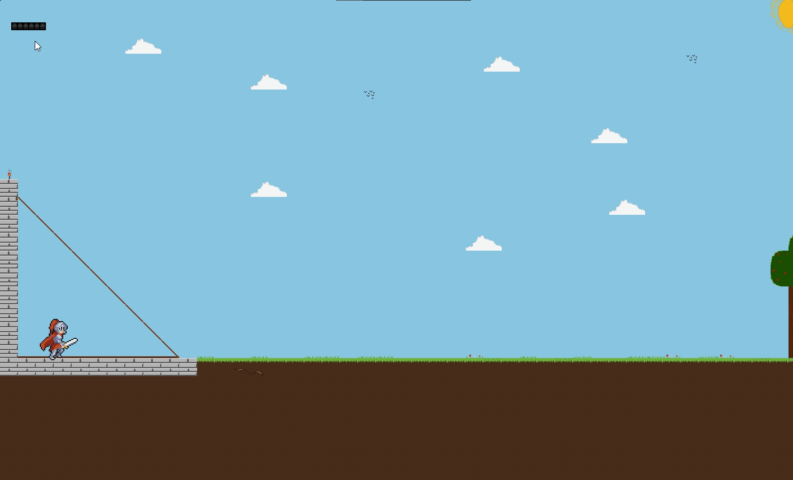
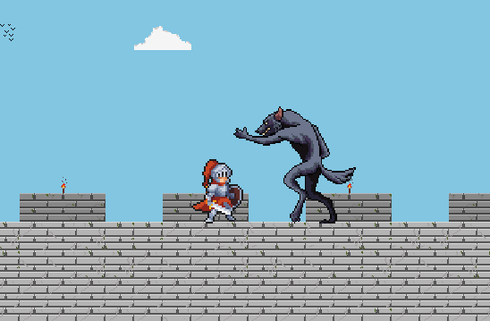

# Knight's Quest: Journey to the Goblin Throne
### This game is currently under development.

🚀 Development Progress
The development of the game is going well.
The player movement and animations are working perfectly. The three maps that make up the first stage, "Bastion Castle of Eldur", are already finished — they may undergo minor tweaks or adjustments.

Additionally, I’ve started working on the first enemies. One of them is the Black Werewolf, which will soon receive a better name. I’m also developing a second type of werewolf that runs and jumps to attack the player.

The stamina bar is nearly complete, with only minor details left to finish. The health bar is also in the same stage, close to being finalized.

## 🗺️ Leaks — Sneak Peeks 
### 🏰 Bastion Castle of Eldur 
       
### ⚔️ Wolf Attack Animation 
 
# ⚖️ Copyright 
© Jaca7x

