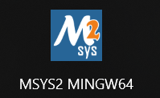

# 🏰 Knight's Quest: Jornada até o trono Goblin  


## Requisitos
Windows (Recomendado: MSYS2 MINGW64)

Recomendo o terminal MSYS2 MINGW64, mas caso utilize outros terminais, aplique os passos abaixo de acordo com o seu ambiente.

MinGW (gcc)<br>

Link do MSYS2 e tutorial:<br>
https://www.msys2.org

Link do site oficial da raylib:<br>
https://www.raylib.com

Após a instalação do MSYS2 e da raylib, você deve abrir:



Dentro do terminal, escreva:

```
$ pacman -Syu
```
Aceite as informações com [Y/y].<br>

Depois que tudo for instalado, o próximo passo é instalar o gcc no terminal. Para isso, utilizaremos a linha de comando:
```
$ pacman -S mingw-w64-x86_64-gcc
```

A partir dessa linha serão baixados os arquivos necessários para rodar os comandos gcc e g++.<br>

Para saber se está funcionando, escreva:
```
gcc --version

ou

g++ --version
```

Se aparecer algo como:
```
gcc.exe (Rev2, Built by MSYS2 project) 15.1.0
Copyright (C) 2025 Free Software Foundation, Inc.
This is free software; see the source for copying conditions.  There is NO
warranty; not even for MERCHANTABILITY or FITNESS FOR A PARTICULAR PURPOSE.
```

Podemos seguir para o próximo passo.<br>

Instalando o Git no MSYS2 (para usar git clone)
```
$ pacman -S git
```

Aceite tudo que for solicitado usando [Y/y].

Para verificar se está funcionando, escreva:
```
git --version
```

Se aparecer algo como:
```
git version 2.49.0
```

Podemos seguir para o próximo passo.<br>

Instalando o Make (para compilar Makefiles)
```
$ pacman -S mingw-w64-x86_64-make
```

Em algumas versões, para verificar se está funcionando, utilize:

```
make --version
```

Caso ocorra erro ou informe que o comando não existe, tente:
```
mingw32-make --version
```
Deve aparecer algo como:
```
GNU Make 4.4.1
Built for x86_64-pc-msys
Copyright (C) 1988-2023 Free Software Foundation, Inc.
License GPLv3+: GNU GPL version 3 or later <https://gnu.org/licenses/gpl.html>
This is free software: you are free to change and redistribute it.
There is NO WARRANTY, to the extent permitted by law.
```

Logo após a instalação de todos os recursos necessários, siga os próximos passos.

⚠️ ATENÇÃO

A raylib precisa estar instalada no seu PC.

Rodando o projeto
Clonando o repositório:
```
git clone https://github.com/Jaca7x/Knight-s-Quest.git
```
```
cd Knight-s-Quest
```

Normalmente esse comando já entra no diretório automaticamente.

Caso não entre (como pode acontecer no MSYS2 MINGW64), tente o caminho abaixo.
Geralmente o repositório clonado fica nesse local; se não estiver, procure a pasta e ajuste o caminho conforme necessário:
```
cd /c/users/seu_usuario/Knight-s-Quest
```

Depois de clonar e entrar no repositório, execute:
```
make
ou
mingw32-make
```

Se aparecer algo como:

 <br>

Tudo deu certo, e agora é só executar o jogo!

Execução no Windows

PowerShell<br>
```
./game
```

MSYS2<br>
```
./game
```

CMD<br>
```
game.exe
```
---
## ✍Referências
- Site oficial do raylib para instalação do mesmo<br>
https://www.raylib.com

- Site oficial do MSYS2 para instalação<br>
https://www.msys2.org

- Vídeo que utilizei para a resolução dos problemas de instalação e compilação do MSYS2<br>
https://www.youtube.com/watch?v=MfDY4pH0p3k

---
## ⚖️ Copyright  
© 2026 **Jaca7x**  
Todos os direitos reservados.  
